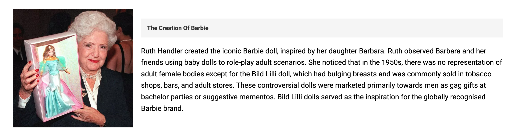

## Barbie Website

The Barbie website serves as a tribute or fan page for fans of Barbie, as well as for individuals interested in brands that focus on empowering women to be their best, much like the character of the doll itself.

Users of this website can find educational content about Barbie's lore, with a focus of how Barbie has evolved to represent diverse roles for women including transgender women to inspire anyone by promoting her as a positive role model. There is even an interactive timeline and slideshow for a more detailed and visual explanation of Barbie's lore. This benefits users by providing an engaging, visually appealing way to explore key historical milestones, thus enhancing educational engagement. The site is responsive for all small, medium and large screen sizes. 

## Features 

#### 1. Navigation bar 

- Fixed at the top of the one-page website, the navigation links are centered under the logo.

- Links to the 'Home', 'History', and 'Impact' section of the website.

- On larger devices, users can click on the 'Home', 'History', and 'Impact' text at the top of the page to navigate the site. 

- On smaller and medium-sized screens, such as tablets, the navigation links can be toggled by clicking the hamburger icon, which expands to show the 'Home', 'History', and 'Impact' text.

- The navigation link texts are highlighted on all devices when the cursor hovers over the text.

#### 2. The Header 

- At the center of the header section is the Barbie fan club logo, which users can click to navigate back to the welcome page.

- The logo sets the main color theme; Barbie pink and white, matching the style of the official Mattel (Barbie) brand.

#### 1. The Home page 

- This section features the welcome banner, with a picture of the iconic Barbie heels showcased in the actual Barbie movie trailer, setting a strong first impression for the Barbie audience. The text "Welcome doll!" placed on top personally addresses the user with a term of endearment, creating a friendly and inviting atmosphere. This increases the likelihood of user engagement with the rest of the site.

- After this, the section below features a photo of Barbie's original creator and explains the inspiration behind the doll. It sets the tone for the website by sharing the influential backstory of how Ruth Handler transformed a concept meant for adult amusement into a pioneering children's product, which has become an iconic and influential brand and role model. This backstory highlights Barbie not merely as a toy, but as a symbol of empowerment and possibility. It encourages users to delve deeper into the website to explore how these values manifest across Barbie's diverse forms and messages.

