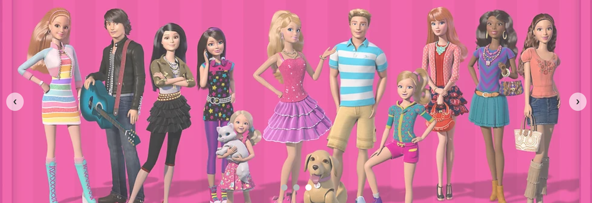
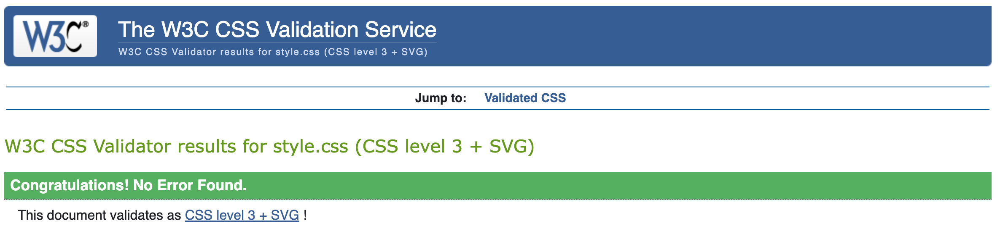

## Barbie Website

The Barbie website serves as a tribute or fan page for fans of Barbie, as well as for individuals interested in brands that focus on empowering women to be their best, much like the character of the doll itself.

Users of this website can find educational content about Barbie's lore, with a focus of how Barbie has evolved to represent diverse roles for women including transgender women to inspire anyone by promoting her as a positive role model. There is even an interactive timeline and slideshow for a more detailed and visual explanation of Barbie's lore. This benefits users by providing an engaging, visually appealing way to explore key historical milestones, thus enhancing educational engagement. The site is responsive for all small, medium and large screen sizes. 

## Features 

#### 1. Navigation bar 

- Fixed at the top of the one-page website, the navigation links are centered under the logo.

- Links to the 'Home', 'History', and 'Impact' section of the website.

- On larger devices, users can click on the 'Home', 'History', and 'Impact' text at the top of the page to navigate the site. 

- On smaller and medium-sized screens, such as tablets, the navigation links can be toggled by clicking the hamburger icon, which expands to show the 'Home', 'History', and 'Impact' text.

- The navigation link texts are highlighted on all devices when the cursor hovers over the text.

#### 2. The Header 

- At the center of the header section is the Barbie fan club logo, which users can click to navigate back to the welcome page.

- The logo sets the main color theme; Barbie pink and white, matching the style of the official Mattel (Barbie) brand.

#### 3. The Home page 

- This section features the welcome banner, with a picture of the iconic Barbie heels showcased in the actual Barbie movie trailer, setting a strong first impression for the Barbie audience. The text "Welcome doll!" placed on top personally addresses the user with a term of endearment, creating a friendly and inviting atmosphere. This increases the likelihood of user engagement with the rest of the site.

- After this, the section below features a photo of Barbie's original creator and explains the inspiration behind the doll. It sets the tone for the website by sharing the influential backstory of how Ruth Handler transformed a concept meant for adult amusement into a pioneering children's product, which has become an iconic and influential brand and role model. This backstory highlights Barbie not merely as a toy, but as a symbol of empowerment and possibility. It encourages users to delve deeper into the website to explore how these values manifest across Barbie's diverse forms and messages.

- Following the Home page section is the History section, which delves further into key milestones of the Barbie brand journey.

- This includes an animated timeline using radio buttons and CSS animations. The timeline features events displayed as a vertical list, each marked with a coloured circle indicating a key event, the date, and a content area showing event details.

- CSS code is used to provide the interactive timeline with smooth animations and accessibility features. It utilises Flexbox for layout, absolute positioning for precise element placement, and transitions for enhanced user interaction.

- The purpose of the timeline is to allow users to digest a lot of content in manageable sections (key events), avoiding overwhelming them with all information at once. By selecting radio buttons, users reveal small sections of text, encouraging continuous reading or checking off of other buttons. Users can also pause and resume at their convenience, providing a more streamlined website experience. 

#### 4. The Impact page 

- The final section explains Barbie’s role in promoting empowerment, inclusivity, and charity, emphasising that Barbie is a symbol of positive values and social impact.

- Text sections are highlighted in different alternating colors to draw attention to specific names and projects shown in the slideshow above. Key phrases such as "Barbie," "Close the Dream Gap," and "Margot Robbie" are emphasized to connect with the relevant images, making the text engaging and easy to scan. The use of colours helps users quickly identify important information and navigate the content more effectively.

- The centered text format makes it manageable to read a big chunk of text, encouraging users to explore the related images (referred to as pictures 1, 2, 3, and 4) for visual evidence.

- The body tone of the text is fun and friendly, matching Barbie’s spirit, ensuring users can easily follow along with the text and slideshow.

#### 5. The Footer 

- The footer section includes text followed by links to Barbie's official Twitter, Instagram, YouTube, and a Barbie Wiki page.

- All links open in a new tab to provide users with additional resources to explore Barbie's lore on various other platforms without leaving the website.

- On all devices, the links are highlighted when the cursor hovers over the icons, enhancing user interaction.

## Testing 

HTML 

No errors found when I ran the index.html code through the <a href="https://validator.w3.org/">The W3C Markup Validation Service</a>

CSS 

No errors found when I ran the style.css code through the <a href="https://jigsaw.w3.org/css-validator/">The W3C CSS Validation Service</a>

## Deployment 

#### Version Control 

The website was developed using the Gitpod editor and uploaded to a GitHub remote repository named 'project-1-barbie-website'. Throughout the development process, Git commands facilitated the management of code updates. These included:

- Using git add . to stage files before committing changes.

- Employing git commit -m "commit message" to finalize changes in the local repository.

- Using git push to upload all committed code to the GitHub remote repository.

#### Deploying to Github Pages involved the following steps:

1. Navigate to the Settings tab of the Github repository.

2. Choose the Master branch from the source section drop-down menu and save the settings.

2. Upon selecting the Master branch, the website link was generated.

Live link: <a href="https://aishieee.github.io/project-1-barbie-website/">Project 1 - Barbie website</a>

##Cloning of the Repository Code locally
Go to the Github repository that you want to clone
Click on the Code button located above all the project files
Click on HTTPS and copy the repository link
Open the IDE of your choice and and paste the copied git url into the IDE terminal
The project is now created as a local clone

#### To clone the repository code locally, follow these steps:

1. Access the GitHub repository you wish to clone.

2. Click on the "Code" button located above the project files.

3. Select "HTTPS" and copy the repository link.

4. Open your preferred Integrated Development Environment (IDE) and paste the copied Git URL into the IDE terminal.

This action creates a local clone of the project.

## Credits 

#### Content 

- The social media icons in the footer were taken from <a href="https://fontawesome.com/">Font Awesome</a>

- The social media links to X, Instagram, and Youtube are the real Mattel official accounts. The Wiki links to <a href="https://barbie.fandom.com/wiki/Barbie_Wiki">the Barbie Wiki, a FANDOM Lifestyle Community.</a>

- The logo in header of the website was created by grouping wordtext and images in powerpoint. The images used were the official Barbie logo and Barbie head. 

The favicon in the header of the website was created.....

#### Media 

- The animated timeline was adapted from <a href="https://codepen.io/rajeshkumarsah/pen/YJpQpJ">Codepen</a> with credits to rajeshkumarsah

- The slideshow was adapted from <a href="https://codepen.io/NicholasByDesign/pen/qBOmQX">Codepen</a> with credits to NicholasByDesign

#### Image Credits

The images used in this project were sourced have been sourced from various locations, including search engines such as Google. I acknowledge that the images may be subject to copyright and encourage users to obtain proper permissions for usage.

<em> Please note: For this project I do not claim ownership of these images and uses them for illustrative purposes under fair use. </em>

- Request for Removal: If you are the copyright owner of any of the images used in this project and believe that their use infringes upon your rights, please contact aisha.sheikh@students.codeinstitute.net immediately. I will promptly remove the images upon verification of your ownership rights.

